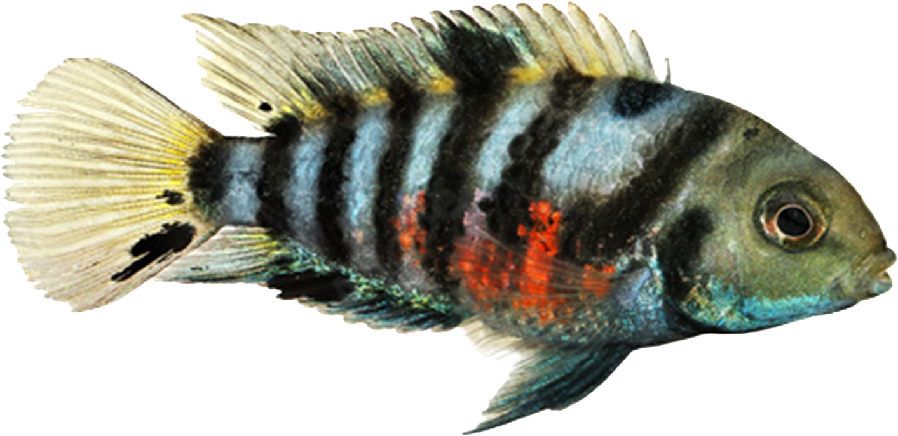

```{r, include = FALSE}
knitr::opts_chunk$set(
  collapse = TRUE,
  comment = "#>"
)
```

```{r setup, include=FALSE}
library(ConvictBehavior)
```

```{r Formatting, include=FALSE}
colorize <- function(x, color) {
  if (knitr::is_latex_output()) {
    sprintf("\\textcolor{%s}{%s}", color, x)
  } else if (knitr::is_html_output()) {
    sprintf("<span style='color: %s;'>%s</span>", color,
      x)
  } else x
}
```

```{r out.width="400px", echo = FALSE}

```

## `r colorize("Introduction", "#0073E6")`

An individual's internal state, or "social state", can influence how they respond to different social cues and contexts. Examples of social states include reproductive state, parental state, status in a hierarchy, and forming a pairbond. These social states can make an individual more aggressive, submissive, or affiliative in different contexts. Convict cichlids (*A. nigrofasciata*) form pairbonds and exhibit bi-parental care (2 different social states). We can use these fish to study how social state influences behavioral response (aggressive vs. affiliative) and if this influence differs between males and females.

## `r colorize("Experimental setup", "#0073E6")`

Convict cichlid pairs were apportioned into four different treatments:

**`r colorize("Rival (pairbond-aggressive):", "#5BA300")`** A second "rival" conspecific male is introduced to the pairbonded male and female. This elicits an aggressive response towards the rival.

**`r colorize("Bond (pairbond-affiliative):", "#89CE00")`** A pairbonded male and female are separated for 30min. When they are re-introduced to each other they exhibit affiliative behaviors.

**`r colorize("Predator (parental-aggressive):", "#B51963")`** A wolf cichlid (convict egg predator) is introduced to the nest of a male and female with fry. This elicits an aggressive response as the convict cichlids defend their nest.

**`r colorize("Retrieval (parental-affiliative):", "#E6308A")`** The fry are removed from the nest and placed in a different part of the tank. The male and female then retrieve their young and bring them back to the nest.

Male and females behaviors were scored for 10 minutes during each treatment. A total of 44 pairs were tested.

## `r colorize("Data analysis", "#0073E6")`

A principle component analysis was run on the raw behavior data first. The eigenvalues for PC1 (Response) and PC2 (Social State) were extracted for each individual. This is the dataset included in the `{ConvictBehavior}` package that we will explore in this vignette.

```{r out.width="500px", echo = FALSE}

```

### `r colorize("Descriptive statistics", "#0073E6")`

Using the `summarise()` function from `{dplyr}`, we get a tibble that holds the mean, median, and SD of PC1 and PC2 eigenvalues grouped by Treatment and Sex.

```{R descriptive, echo = FALSE, warning = FALSE}
avg <- ConvictData |>
  dplyr::group_by(Treatment, Sex) |>
  dplyr::summarise(meanPC1=mean(PC_1_value), sdPC1=sd(PC_1_value), medianPC1=median(PC_1_value), meanPC2=mean(PC_2_value), sdPC2=sd(PC_2_value), medianPC2=median(PC_2_value))

avgstats <- head(avg)
print(avgstats)

```

### `r colorize("Visualize data", "#0073E6")`

Next, we use the `NiceBoxplot()` function included in the `{ConvictBehavior}` package. The NiceBoxplot courteously replaces underscores with spaces when formatting the title ("Boxplot of PC 1 value" instead of "Boxplot of PC_1_value") and also capitalizes the first letter of x-axis labels.

```{R visualize, warning = FALSE, fig.width=6, fig.height=4}
PC1plot <- NiceBoxplot(df = ConvictData, response = 'PC_1_value', predictor = 'Treatment', type = 'Sex', palette = Palette_Default)
PC2plot <- NiceBoxplot(df = ConvictData, response = 'PC_2_value', predictor = 'Treatment', type = 'Sex', palette = Palette_Default)
print(PC1plot)
print(PC2plot)
```

Using this general descriptive method, we can see in the first boxplot that **`r colorize("Bond", "#89CE00")`** and **`r colorize("Retrieval", "#E6308A")`** (the two affiliative treatments) appear to cluster together, while **`r colorize("Predator", "#B51963")`** and **`r colorize("Rival", "#5BA300")`** (the two aggressive treatments) appear to cluster together. Males and females appear to have no statistically significant differences in response based on their treatment groups. However, treatment groups appear to be distinct from one another. In the second boxplot it appears that males do not differ between treatments along PC2, but females in **`r colorize("Predator", "#B51963")`** and **`r colorize("Retrieval", "#E6308A")`** treatments differ from females in **`r colorize("Bond", "#89CE00")`** and **`r colorize("Rival", "#5BA300")`** treatments along PC2.

### `r colorize("Visualize data (Continued)", "#0073E6")`

A NiceBoxplot should have accessible colors, something we can check using the next function, `ColorblindPlot()`. This displays the plot in a few examples of colorblind vision, and also a greyscale version in case our plot is printed in black and white.

```{R visualizeColors, warning = FALSE, fig.width=12, fig.height=4}
PC1plot2 <- ColorblindPlot(df = ConvictData, response = 'PC_1_value', predictor = 'Treatment', type = 'Sex', palette = Palette_Default)
PC2plot2 <- ColorblindPlot(df = ConvictData, response = 'PC_2_value', predictor = 'Treatment', type = 'Sex', palette = Palette_Default)
print(PC1plot2)
print(PC2plot2)
```

### `r colorize("Test for significant differences with ANOVA", "#0073E6")`

To test the validity of these claims, we must use an ANOVA test. An ANOVA allows you to test the statistical difference between several categorical variables. In this case we will be using an ANOVA to determine whether treatment group, social state, response, sex, or the interactions between any of these variables is statistically different from each other in terms of PC1 and PC2 eigenvalues. However, ANOVAs make an assumption of normality, and require roughly equal sample variances. Thus, we must check the residuals of our ANOVA models and test for normality.

First we use the `{stats}` `aov()` function to create an ANOVA with all the explanatory variables and PC1 as the response variable.

```{R ANOVA_PC1}
#PC1 - Affiliative vs Aggressive (Response)
m1 <- aov(data = ConvictData, PC_1_value ~ Treatment + State + Response + Sex + Treatment:Sex + State:Sex + Response:Sex)
```

Next we use the `NormCheck()` function, which includes the `qqnorm()` function and `shapiro.test()` function, to determine if our ANOVA assumptions are correct.

```{R}
NormCheck(df = ConvictData, response = 'PC_1_value', predictor1 = 'Treatment', predictor2 = 'State', predictor3 = 'Response', type = 'Sex')
```

The QQplot does not perfectly match the QQline end to end, suggesting that residuals do not fall in line with our assumption of normal distribution. To confirm, using the `shapiro.test()` function, we ran a Shapiro-Wilk test. The results of the Shapiro-Wilk test provide a *P*-value \< 0.05, suggesting that our data distributes differently from that of a normal distribution.

We can attempt to resolve this by log-transforming the data and retesting for normality.

```{R log, warning = FALSE, echo = FALSE}
#Rerun with log transform
#PC1 - Affiliative vs Aggressive (Response)
m1_l <- aov(data = ConvictData, log(PC_1_value) ~ Treatment + State + Response + Sex + Treatment:Sex + State:Sex + Response:Sex)
broom::tidy(m1_l)

#Q plot of residuals
qqnorm(m1_l$residuals)
qqline(m1_l$residuals)

#Test for normality
(s <- shapiro.test(m1_l$residuals))
```

Yet again, the results of the Shapiro-Wilk test provide a *P*-value \< 0.05, suggesting that our data distributes differently from that of a normal distribution. Thus, we must use a non-parametric version of an ANOVA, which does not hold the same assumption of normal distributions: The Kruskal-Wallis test.

We next run a Kruskal-Wallis test of PC1 eigenvalues against treatment and sex.

```{R}
#Use non-parametric Kruskal-Wallis test
#Treatment
(kw1_t <- kruskal.test(data = ConvictData, PC_1_value ~ Treatment))
#Sex
(kw1_s <- kruskal.test(data = ConvictData, PC_1_value ~ Sex))
```

The resultant *P*-values are \< 0.05 in both cases, suggesting both are significant predictors of the variance found in PC1 values.

Next, we run an ANOVA of the same explanatory variables against PC2 with interactions and test residuals for normality.

```{R}
#PC2 - Bond vs Parental (State)
NormCheck(df = ConvictData, response = 'PC_2_value', predictor1 = 'Treatment', predictor2 = 'State', predictor3 = 'Response', type = 'Sex')
```

According to the Shapiro-Wilk test, the distribution of residuals is not normal, thus we attempt to solve this using a log transformation.

```{R}
#Rerun with log transform
#PC2 - Bond vs Parental (State)
m2_l <- aov(data = ConvictData, log(PC_2_value) ~ Treatment + State + Response + Sex + Treatment:Sex + State:Sex + Response:Sex)
broom::tidy(m2_l)
```

The ANOVA model m2_1 produced *P*-values \< 0.05 for Treatment, Sex, and their interaction, confirming that these these variables significantly differ from one another.

```{R warning = FALSE, echo = FALSE}
#Q plot of residuals
qqnorm(m2_l$residuals)
qqline(m2_l$residuals)

(s <- shapiro.test(m2_l$residuals))
```

Given that the Shapiro-Wilk test for m2_l residuals produced a p value \> 0.05, we can conclude that this relationship (marginally) achieves normality of residuals. Thus, an ANOVA is an appropriate test for observing the relationships between PC2 and the categorical variables.

From the results of both ANOVAs, we can confirm that Treatment, Sex, and Treatment:Sex all appeared to significantly differ from one another, but we cannot interpret how these different categories differ from one another. To answer this, we must perform a Post-Hoc Tukey test (or in the case of non parametric data: a Mann-Whitney U).

### `r colorize("Post-hoc test", "#0073E6")`

```{R}
#PC1 - Affiliative vs Aggressive (Response)
(Tukey_1 <- TukeyHSD(m1, which = "Treatment", ordered = TRUE, conf.level = 0.95))

(MWU_1<-pairwise.wilcox.test(ConvictData$PC_1_value, ConvictData$Treatment, p.adjust.method = "bonferroni"))
```

Using both the Tukey and MWU tests, we can get a more detailed understanding of the relationships between each variable. For PC1, we found that **`r colorize("Bond", "#89CE00")`** treatments significantly differ from **`r colorize("Predator", "#B51963")`**, **`r colorize("Retrieval", "#E6308A")`**, and **`r colorize("Rival", "#5BA300")`** treatments across males and females. We also found that **`r colorize("Predator", "#B51963")`** treatments significantly differed from **`r colorize("Retrieval", "#E6308A")`** treatments, but not **`r colorize("Rival", "#5BA300")`** treatments in PC1. Lastly, we found that **`r colorize("Retrieval", "#E6308A")`** treatments significantly differed from **`r colorize("Rival", "#5BA300")`** treatments across PC1. 


```{R}
#PC2 - Bond vs Parental (State)
(Tukey_2 <- TukeyHSD(m2_l, which = "Treatment:Sex", ordered = TRUE, conf.level = 0.95))
```
In the Tukey test for treatment:sex of the ANOVA for PC2, we found several significant differences specific to both males and females. In females, **`r colorize("Predator", "#B51963")`** treatments differed from F-**`r colorize("Rival", "#5BA300")`** and F-**`r colorize("Bond", "#89CE00")`** treatments across PC2. In males, **`r colorize("Predator", "#B51963")`** treatment differed from F-**`r colorize("Bond", "#89CE00")`** treatments and F **`r colorize("Rival", "#5BA300")`** treatments. Additionally, males differed in **`r colorize("Retrieval", "#E6308A")`** treatments as opposed to F **`r colorize("Rival", "#5BA300")`** treatments. Male **`r colorize("Retrieval", "#E6308A")`** treatments also differed from F-**`r colorize("Retrieval", "#E6308A")`** treatments and M-**`r colorize("Predator", "#B51963")`** treatments differed from F **`r colorize("Retrieval", "#E6308A")`** treatments. All other treatments did not appear to have any discernible relationship by sex or interaction with sex along PC2. 

While we understand which variables explain variation across PC1 and PC2, how would we know which variables and interactions best describe the response variable? To answer this question, we must use Model Selection. 

## `r colorize("Model Selection using AICc", "#0073E6")`

Model selection is a method by which we compare different explanatory variables in their ability to predict the response variable, and attempt to find a model that best explains the response variable, without adding unnecessary explanatory variables that may not be as relevant. To select for the ideal model we will use a stepwise selection function we have created. This function uses the AICc to determine the relative fit of the model.

First we need to build the ANOVA models for PC1 and PC2 again.

```{r}
# PC2 model
m2_l <- aov(data = ConvictData, log(PC_2_value) ~ Treatment + State + Response + Sex + Treatment:Sex + State:Sex + Response:Sex)

m0<- aov(data = ConvictData, log(PC_2_value) ~ 1)
m1<- aov(data = ConvictData, log(PC_2_value) ~ Treatment)
m2<- aov(data = ConvictData, log(PC_2_value) ~ Treatment + State)
m3<- aov(data = ConvictData, log(PC_2_value) ~ Treatment + State + Response)
m4<- aov(data = ConvictData, log(PC_2_value) ~ Treatment + State + Response + Sex)
m5<- aov(data = ConvictData, log(PC_2_value) ~ Treatment + State + Response + Sex + Treatment:Sex)
m6<- aov(data = ConvictData, log(PC_2_value) ~ Treatment + State + Response + Sex + Treatment:Sex + State:Sex)
#PC1 kruskal wallis models
kw1_t <- kruskal.test(data = ConvictData, PC_1_value ~ Treatment)
kw1_s <- kruskal.test(data = ConvictData, PC_1_value ~ Sex)
```

Then we use our stepwise AIC function to get AIC values for each model.

```{r}
(s<- MASS::stepAIC(m2_l, scope = . ~ ., direction = "both"))
summary(s)
```

In this function for the AIC, we find that the model including only treatment and sex appears to be the optimal model. Next, we must correct said models for small sample sizes. 

```{r AICc}
AICcmodavg::aictab(list(m0,m1,m2,m3,m4,m5,m6,m2_l), c("m0", "m1", "m2", "m3", "m4", "m5", "m6", "m2_l"))
```

From this AICc list, we find that anova model 4: Treatment + State + Response + Sex, was relatively the most optimal model.

## `r colorize("Conclusion", "#0073E6")`

Thus far, we can conclude that female behavioral response appears to be influenced by social state, while male behavioral response is not.
